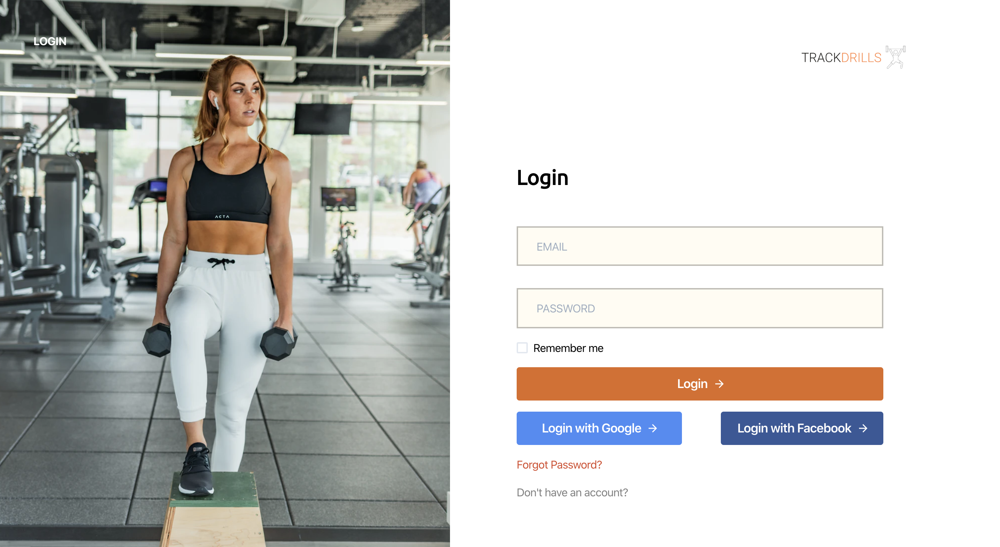

# About Trackdrills

Trackdrills is a web application that gives you access to over 500 workout and exercises to choose from to suit your fitness goals. It is a health focused app that also gives you the ability to create your own customised workout plans and track your progress.

# Meet the Team

|                                          [Ezekiel Ekunola](https://github.com/easybuoy)                                          |                                                [Amira Adediran](https://github.com/amxra)                                                 |                                         [Modurotolu Olokode](https://github.com/durotolu)                                          |                                       [Folasade Agbaje](https://github.com/estheragbaje)                                       |                                   [Melquisedeque Pereira](https://github.com/melquip)                                    |
| :------------------------------------------------------------------------------------------------------------------------------: | :---------------------------------------------------------------------------------------------------------------------------------------: | :--------------------------------------------------------------------------------------------------------------------------------: | :----------------------------------------------------------------------------------------------------------------------------: | :----------------------------------------------------------------------------------------------------------------------: |
|         |                     |           |  |  |
|                                             |                                                         |                                               |                                       |                                      |
|          |  |  |  |  |
|                                    [**Sandrava Philips**](https://github.com/Sandravaphilips)                                    |                                           [**Oluwafemi Anjorin**](https://github.com/Leelsmuth)                                           |                                                                                                                                    |
|  |                 |                                                                                                                                    |
|                                      |                                                     |                                                                                                                                    |
|   |          |

# Project Overview

[Trello Board](https://trello.com/b/iTrFFYwu/labseu3-workout-tracker)  
[Product Canvas](https://www.notion.so/EU3-Workout-Tracker-07d713eeab674a938ea65ce065462384)  
[UX Design files](https://www.figma.com/file/r3J1gqHSg2Mci8tHb6vXdd/Trackdrills)  
[Landing Page](https://trackdrills.com/)  
[API](https://trackdrills.herokuapp.com/)  

### Basic Features

- User should be able to sign up and login
- User should be pick from a list of exercises and view exercise details
- User should be pick from a list of workouts and view workout details
- User should be able to access workout history page
- User should be able to schedule a workout, as a routine or one-time
- User should be able to access the dashboard
- User should be able to get dashboard notifications or email notifications
- User should be able to update profile details
- User should be able to create custom workouts
- User should be able to share completed workout with friends on social media

# Table of Contents

- [Scripts](#scripts)
  - [Running](#running)
- [Environment Variables](#environment-variables)
- [Tech-Stack](#tech-stack)
  - [Front-End Dependencies `(Production)`](#front-end-dependencies-production)
    - [React](#react)
    - [GraphQL](#graphql)
    - [React Apollo](#react-apollo)
    - [Dotenv](#dotenv)
    - [Styled-
      Components](#styled-components)
    - [Chakra-UI](#chakra-ui)
    - [Prop-Types](#prop-types)
    - [JWT-Decode](#jwt-decode)
    - [Coveralls](#coveralls)
    - [Formik](#formik)
    - [Yup](#yup)
    - [Recharts](#recharts)
- [Front-End Dependencies `(Development)`](#front-end-dependencies-development)
  - [Eslint](#eslint-1)
  - [Prettier](#prettier)
  - [Lint Staged](#lint-staged)
  - [Husky](#husky)

# Scripts

## Running

`npm start`: Runs only the front-end client.

`npm test`: Will run the tests for front-end

`npm run build`: Will create a build file for front-end

# Environment Variables

For the app to function correctly, the user must set up their own environment variables. There should be a .env file containing the following:

    REACT_APP_GraphQL_API=https://trackdrills-staging.herokuapp.com/api

    REACT_APP_GraphQL_API_SUBSCRIPTIONS=ws://trackdrills-staging.herokuapp.com/graphql

    REACT_APP_GOOGLE_CLIENT_ID=970094315674-fv6hgk4uta5tmpa91poc6444qlqt9e96.apps.googleusercontent.com

    REACT_APP_GOOGLE_ANALYTICS_KEY=UA-154765930-1

# Tech-Stack

## Front End Dependencies `(Production)`

### React

React is the current industry standard that offers a lot of out of the box benefits. It is fast, efficient, and scalable. Due to the large community, finding solutions to potential problems and reference material is much easier, even for a potential dev without a lot of experience who would like to contribute to Main Course. | [View Dependency](https://reactjs.org/docs/getting-started.html)

### GraphQL

GraphQL is a query language for APIs and a runtime for fulfilling those queries with your existing data. GraphQL provides a complete and understandable description of the data in your API, gives clients the power to ask for exactly what they need and nothing more, makes it easier to evolve APIs over time, and enables powerful developer tools. | [View Dependency](https://graphql.org/)

### React Apollo

React Apollo allows you to fetch data from your GraphQL server and use it in building complex and reactive UIs using the React framework. React Apollo may be used in any context that React may be used. In the browser, in React Native, or in Node.js when you want to do server-side rendering. | [View Dependency](https://apollographql.com)

### dotenv

Dotenv is a zero-dependency module that loads environment variables from a .env file into process.env. Storing configuration in the environment separate from code is based on The Twelve-Factor App methodology. | [View Dependency](https://www.npmjs.com/package/dotenv)

### Styled-Components

Has a thriving community and offers the ability to directly style multiple components within a file. The syntax used is familiar to JavaScript and improves code cleanliness and makes it easy to get up and going for those without a lot of css experience. Styled components are also very efficient, improving load time for users. | [View Dependency](https://www.styled-components.com/docs/)

### Chakra-UI

Chakra UI is a simple, modular and accessible component library that gives you all the building blocks you need to build your React applications. | [View Dependency](https://chakra-ui.com/)

### Prop-Types

Allows declaration of types for React Props. | [View Dependency](https://reactjs.org/docs/typechecking-with-proptypes.html)

### JWT-Decode

Jwt-decode is a small browser library that helps decoding JWTs token which are Base64Url encoded. This library doesn't validate the token, any well formed JWT can be decoded. | [View Dependency](https://www.npmjs.com/package/jwt-decode)

### Coveralls

Shows which parts of code aren't covered by the test suite | [View Dependency](https://docs.coveralls.io/)

### Formik

Helps to keep track of values/errors/visited fields, orchestrating validation, and handling submission on a from | [View Dependency](https://jaredpalmer.com/formik/docs/overview)

### Yup

Yup is a JavaScript schema builder for value parsing and validation. | [View Dependency](https://www.npmjs.com/package/yup)

### Recharts

A composable charting library built on React components, | [View Dependency](http://recharts.org/en-US/)

## Front-End Dependencies `(Development)`

### Eslint

Eslint is the dominant linting tool for NodeJS and it makes it possible to establish a clear coding convention for a team or project, as well as aiding in catching various bugs such as variables improperly scoped. | [View Dependency](https://eslint.org/)

### Prettier

Prettier is an opinionated code formatter that enforces a consistent code style across the entire codebase. | [View Dependency](https://prettier.io/)

### Lint Staged

The concept of lint-staged is to run configured linter (or other) tasks on files that are staged in git. lint-staged will always pass a list of all staged files to the task, and ignoring any files should be configured in the task itself. | [View Dependency](https://www.npmjs.com/package/lint-staged/)

### Husky

Husky is a very popular pre-commit git hook that ensures code linting and unit tests are passing before one is able to commit code. | [View Dependency](https://www.npmjs.com/package/husky)
